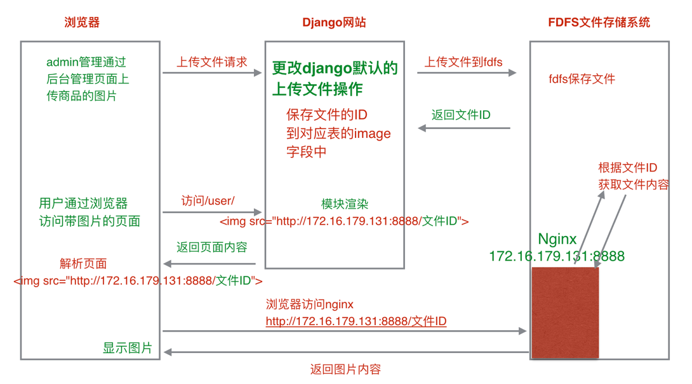

# ecommerce_website_development
本项目基于Django1.8.2等来开发一个电商平台，可实现注册、登录、浏览、购买、支付等全部常用功能。


## 20180309

- web项目开发的一般流程。

  ```
  项目立项->需求分析->原型设计
  后端：架构设计->数据库设计->模块代码实现和单元测试
  前端: UI设计->前端设计
  代码整合->集成测试->网站发布(项目上线)
  ```

- 天天生鲜项目的需求和架构设计。

  ```
  四大模块:
  1）用户模块: 注册、激活、登录、退出、用户中心
  2）商品模块: 首页、详情页、列表页、商品搜索
  3）购物车模块: 购物车记录的增、删、改、查
  4）订单模块: 订单创建、订单显示、订单支付
  ```

- 天天生鲜项目数据库的设计和分析。

  ```
  数据库设计:
  1）用户模块
    用户表(df_user)
    地址表(df_address)

  2）商品模块
    商品种类表(df_goods_type)
    商品SPU表(df_goods)
    商品SKU表(df_goods_sku)
    商品图片表(df_goods_image)
    首页轮播商品表(df_index_banner)
    首页促销活动表(df_index_promotion)
    首页分类商品展示表(df_index_type_goods)

  3) 购物车模块
    redis实现

  4）订单模块
    订单信息表(df_order_info)
    订单商品表(df_order_goods)

  数据库设计注意点:
  1）对于一对多的关系，应该设计两张表，并且多表中存放外键。
  2）数据库设计时，有些时候需要以空间换取时间。
  ```

- 天天生鲜项目相关模型类的设计。

  ```
  choices: 限定字段的取值范围。

  富文本编辑器的使用:
  1）安装包
    pip install django-tinymce==2.6.0

  2）注册应用并配置
    INSTALLED_APPS = (
      # ...
      'tinymce', # 富文本编辑器
      # ...
    )

    TINYMCE_DEFAULT_CONFIG = {
      'theme': 'advanced',
      'width': 600,
      'height': 400,
    }

  3）项目的urls中添加url配置项。
    urlpatterns = [
      # ...
      url(r'^tinymce/$', include('tinymce.urls')), # 富文本编辑器
      # ...
    ]

  使用富文本类型:
  1）导入类型
    from tinymce.models import HTMLField

  2）创建模型类
    class Goods(models.Model):
      """商品模型类"""
      detail = HTMLField(verbose_name='商品详情')
  ```

- 天天生鲜项目框架的搭建过程。

  ```
  项目框架搭建流程:
  1）创建Django项目
  2）根据项目功能模块划分创建应用
  3）进行基本配置(注册应用，模板文件目录，静态文件目录，数据库配置)
  4）模型类的设计
  5）迁移生成数据表

  注意点:
  1）项目中存储用户信息时需要覆盖Django默认的认证系统用户模型类，所以生成迁移文件之前需要在
  settings.py配置文件中进行如下设置:
    AUTH_USER_MODEL = 'user.User'
  ```

## 20180310

- 类视图来填充views.py。

  ```
  类视图:
    访问url时采用不同的请求方式(get、post)，就会调用类视图中对应的方法。

  使用:
  1) views.py中定义类视图
  class RegisterView(View):
    def get(self, request):
      """注册页面显示"""
      pass

    def post(self, request):
      """注册处理"""
      pass

  2) 在urls.py中进行配置
  from someapp.views import RegisterView
  urlpatterns = [
    # ...
    url(r'^register$', RegisterView.as_view(), name='register')
    # ...
  ]
  ```

- django中常见认证相关函数的使用。

  ```
  导入:
    from django.contrib.auth import create_user, authenticate, login, logout

  create_user: 添加用户。
  authenticate: 认证用户。
  login: 记住用户登录状态。
  logout: 清除用户登录状态。
  ```

- django中邮件的发送。

  ```
  1）配置文件中进行邮件相关配置。
    EMAIL_BACKEND = 'django.core.mail.backends.smtp.EmailBackend'
    EMAIL_HOST = 'smtp.163.com'
    EMAIL_PORT = 25
    #发送邮件的邮箱
    EMAIL_HOST_USER = 'itcast88@163.com'
    #在邮箱中设置的客户端授权密码
    EMAIL_HOST_PASSWORD = 'python808'
    #收件人看到的发件人
    EMAIL_FROM = 'python<itcast88@163.com>'
  2）使用send_mail函数发送邮件。
    from django.core.mail import send_mail
    send_mail(
      subject='邮件主题',
      message='邮件正文',
      from_email='发件人',
      recipient_list='收件人列表',
      html_message='包含html的邮件内容')
  ```

- itsdangerous包加密解密的简单使用，对邮件确认时发送的url进行加密添加。

  ```
  安装:
    pip install itsdangerous

  使用:
    from itsdangerous import TimedJSONWebSignatureSerializer as Serializer
    from itsdangerous import SignatureExpired

    # 创建Serializer类对象
    serializer = Serializer('加解密密钥', '解密有效时间')
    info = {'confirm': 1}
    # 调用dumps方法实现加密，返回值类型为bytes
    token = serializer.dumps(info)
    # 调用loads方法实现解密
    try:
      res = serializer.loads(token)
    except SignatureExpired as e:
      # 超过解密有效时间，抛出异常
      pass
  ```

- celery异步任务队列的使用，将发送邮件等耗时操作由其操作，以便提升前端用户体验。

  ```
  celery(异步任务队列):
  1) 任务发出者: 发出任务。
  2) 任务处理者: 处理任务。
  3）中间人(broker): 又叫任务队列，用于任务发出者和处理者之间信息的交换。

  注意点:
  1）celery中，任务发出者、中间人和任务处理者可以在不同的电脑上，但前提是
  发出者和处理者必须都能连接到中间人。
  2）在celery中，任务就是函数，处理者就是工作的进程。
  3）celery发出任务时，只是发出的要执行的任务函数的名字和所需的参数。

  使用:
  1）安装
    pip install celery
  2) 无论是发出任务还是启动工作的进程，都需要一个Celery类的对象。
    from celery import Celery
    app = Celery('demo', broker='中间人地址')
  3）定义任务函数tasks.py
    @app.task
    def task_func(a, b):
      print('任务函数...')
  4）启动工作进程
  celery -A 任务函数所在文件的路径 worker -l info
  5）发送任务
  task_func.delay(2, 3)
  ```

- 用户注册的处理流程。

  ```
  # /user/register
  class RegisterView(View):
      def post(self, request):
        """注册处理"""
        # 获取参数

        # 参数校验(参数完整性校验，邮箱格式校验)

        # 业务处理: 注册处理
          # 校验用户名是否已被注册
          # 添加注册用户的信息(调用create_user方法)
          user = User.objects.create_user('用户名', '邮箱', '密码')
          # 生成激活token信息
          # 使用celery发出发送邮件任务
          # 跳转到首页
  ```

- 用户激活的处理流程。

  ```
  # /user/active/激活token信息
  class ActiveView(View):
      def get(self, request, token):
        """激活"""
        # 创建Serializer对象
        try:
          # 解密
          # 获取待激活用户的id
          # 查找用户并设置激活标记
          # 跳转到登录页
        except SignatureExpired as e:
          # 激活链接已失效
          pass
  ```

- 用户登录和退出的处理流程。

  ```
  # /user/login
  class LoginView(View):
    def post(self, request):
      """登录处理"""
      # 获取参数

      # 参数校验(完整性校验)

      # 业务处理: 登录验证
      # 验证用户名和密码的正确性(调用authenticate方法)
      user = authenticate(username='用户名', password='密码')
      if user is not None:
        # 用户名密码正确
        if user.is_active:
          # 用户已激活
          # 记录用户的登录状态(调用login方法)
          login(request, user)

          # 判断是否需要记住用户名

          # 跳转到首页，跳转传递参数：1、session设置；2、cookies设置；
          # 3、内置的user.is_authenticated
        else:
          # 用户未激活
      else:
        # 用户名或密码错误

  # /user/logout
  class LogoutView(View):
    def get(self, request):
      """退出"""
      # 清除用户的登录状态(调用logout方法)
      logout(request)

      # 跳转到登录页面
  ```

- request对象的user属性。

  ```
  每个请求到达Django框架后，request对象都会有一个user属性。
  1）如果用户已登录，request.user是一个认证系统用户模型类(User)的对象，包含登录用户的信息。
  2）如果用户未登录，request.user是一个匿名用户类(AnonymousUser)的对象。

  User类和AnonymousUser类对象都有一个方法is_authenticated方法。
  User类这个方法返回的是True, AnonymousUser类这个方法返回的是False。
  通过reqeust.user.is_authenticated()可以判断用户是否登录。

  注意:
  1) 在模板文件中可以直接使用一个模板变量user，其实就是request.user。

  ```

- 使用django-redis配置缓存和存储session信息。

  ```
  1) 安装
  pip install django-redis

  2) 配置
  # Django框架中缓存配置
  CACHES = {
    "default": {
        "BACKEND": "django_redis.cache.RedisCache",
        # 设置缓存信息存储到redis中
        "LOCATION": "redis://redis主机ip:redis主机port/1",
        "OPTIONS": {
            "CLIENT_CLASS": "django_redis.client.DefaultClient",
        }
    }
  }
  # Django框架中的session存储配置
  # 设置session存储到缓存中
  SESSION_ENGINE = "django.contrib.sessions.backends.cache"
  # session存储到CACHES配置项中default对应的redis数据库中
  SESSION_CACHE_ALIAS = "default"
  ```

## 20180311

- <font color=red>父模板页抽象的一般原则</font>。

  ```
  1）针对静态index.html，从上向下进行浏览，所有页面都有的内容保留，某些位置每个页面都不相同则预留块。
  2）对于大多数页面都相同的内容，也可以放在父模板中，但是要包在块中。
  ```

- django中<font color=red>login_required装饰器</font>函数的作用。

  ```
  from django.contrib.auth.decorators import login_required
  功能:
    1) 验证用户是否登录。
    2) 如果用户未登录则跳转到settings.LOGIN_URL指定的地址，同时把访问的url通过next参数跟在
    LOGIN_URL地址后面。
    3) 如果用户已登录，则调用对应的视图。

  使用:
    1）方式1: 在进行url配置时，手动调用login_required装饰器。
        url(r'^user_center_info$', login_required(User_center_infoView.as_view(), login_url='/user/login'), name='user_center_info'),
    2）方式2:重写View类的as_view方法
      2.1 定义一个类LoginRequiredView, 继承View。
      2.2 重写as_view, 在重写的as_view方法中调用login_required实现登录验证。
      class LoginRequiredView(View):
        @classmethod
        def as_view(cls, **initkwargs):
            # 调用View类中as_view方法
            view = super(LoginRequiredView, cls).as_view(**initkwargs)

            # 进行登录验证
            return login_required(view)
      2.3 需要登录验证的类视图直接继承LoginRequiredView。
        class UserInfoView(LoginRequiredView):
            # ...
            pass

    3）方式3:
      3.1 定义一个类LoginRequiredMixin, 继承object。
      3.2 定义as_view，先使用super调用as_view, 在调用login_required实现登录验证。
      class LoginRequiredMixin(object):
        @classmethod
        def as_view(cls, **initkwargs):
            # 调用View类中as_view方法
            view = super(LoginRequiredMixin, cls).as_view(**initkwargs)

            # 进行登录验证
            return login_required(view)
      3.3 需要登录验证的类视图先继承与LoginRequiredMixin, 再继承View。
      class UserInfoView(LoginRequiredMixin, View):
          # ...
          pass

  ```

- 4.自定义模型管理器类的方法及其使用场景：更好的对模型类对应的数据表进行增删改查。

  ```
  1）定义一个类，继承models.Manager。
  class AddressManager(models.Manager):
      """地址模型管理器类"""
      # 封装方法: 改变原有查询的结果集
      # 封装方法: 用于操作管理器对象所在模型类对应的数据表(增，删，改，查)
      pass

  2）在对应模型类中创建一个自定义模型管理器类的对象。
  class Address(models.Model):
      """地址模型类"""
      # ...
      # 自定义模型管理器对象
      objects = AddressManager()

  ```

- 用户历史浏览记录存储的分析过程——一般用户最近浏览的均为用户的感兴趣群体数据，有助于推荐更精准的广告或者产品。

  ```
  问题分析:
  1）什么时候需要添加用户历史浏览的记录？
  答:当用户点击某个商品，访问商品的详情页面(详情页视图)的时候，才要添加历史浏览记录。

  2）什么时候需要获取用户历史浏览的记录？
  答: 当用户访问用户中心-信息页(信息页视图)的时候，需要获取用户的历史浏览记录。

  3）保存用户的历史浏览记录需要保存哪些数据？
  答: 保存商品id，添加历史浏览记录时需要保持用户的浏览顺序。

  4）数据需要保存在哪里？
  答: 数据持久化保存: 文件 mysql数据库 redis数据库。对于频繁操作的数据，为了提高处理的效率，
  建议放在redis数据库。

  5）采用redis中哪种数据格式？key-value key是字符串类型，value分为5种类型。
  存储方案1：所有用户的历史浏览记录用一条数据来保存。
    key: history
    值选择hash, 属性(user_用户id), 用hash的属性来区分每一个用户。
    属性(user_用户id)的值来保存用户浏览的商品的id, 属性值保存成以逗号分隔的字符 '2,3,4'

  存储方案2：每个用户的历史浏览记录用一条数据来保存。
    key: history_用户id 用key来区分每一个用户
    value选择list: [3, 1, 2]，最新浏览的商品的id添加到列表最左侧

  存储方案1操作历史浏览记录时需要进行额外的字符串操作，存储方案2的效率更高。
  ```

<font color=blue>一个常见的问题: mySQL里有2000w数据，redis中只存20w的数据，如何保证redis中的数据都是热点数据</font>：

相关知识点：

- redis 内存数据集大小上升到一定大小的时候，就会施行数据淘汰策略。
- redis<font color=red>常见的六种淘汰策略</font>：
  - volatile-lru：从已设置过期时间的数据集（server.db[i].expires）中挑选最近最少使用的数据淘汰；
  - volatile-ttl：从已设置过期时间的数据集（server.db[i].expires）中挑选将要过期的数据淘汰；
  - volatile-random：从已设置过期时间的数据集（server.db[i].expires）中任意选择数据淘汰；
  - allkeys-lru：从数据集（server.db[i].dict）中挑选最近最少使用的数据淘汰；
  - allkeys-random：从数据集（server.db[i].dict）中任意选择数据淘汰；
  - no-enviction（驱逐）：禁止驱逐数据。

<font color=blue>限制用户短时间内登录次数的问题：</font>

```python
"""用列表实现:列表中每个元素代表登陆时间,只要最后的第5次登陆时间和现在时间差不超过1小时就禁止登陆"""
"""
请用Redis和任意语言实现一段恶意登录保护的代码，限制1小时内每用户Id最多只能登录5次
"""
import redis
import sys
import time

r = redis.StrictRedis(host='127.0.0.1', port=6379, db=1)
try:
    id = sys.argv[1]
except:
    print('input argument error')
    sys.exit(0)
# 将每次登陆的时间存入redis的名为login_item列表中，判断列表元素个数是否已达到5并且和第一次登录时间比较是否在一个小时以内。
if r.llen('login_item') >= 5 and (time.time() - float(r.lindex('login_item', 4)) <= 3600):
    print('you are forbidden logining')
else:
    print('you are allowed to login')
    r.lpush('login_item', time.time())
```

## 20180312

- 1.FDFS文件存储系统。

  ```
  基本概念:
    tracker-server: 跟踪服务器，负责调度，管理storage-server。
    storage-server: 存储服务器，用来存储上传的文件，定时的向tracker-server发送自己的状态信息。

  FDFS系统特点:
    1）扩展存储容量方便，实现海量存储。
    2）负载均衡。

  提供FDFS中的文件:
    在FDFS文件存储服务器上搭建Nginx服务器，负责提供FDFS系统中的文件。

  相关环境启动:
    1) 启动fdfs文件存储服务器
      sudo service fdfs_trackerd start # 启动tracker-server
      sudo service fdfs_storaged start # 启动storage-server

    2) 停止fdfs文件存储服务器
      sudo service fdfs_trackerd stop # 停止tracker-server
      sudo service fdfs_storaged stop # 停止storage-server

    3）启动、停止nginx服务器
      sudo /usr/local/nginx/sbin/nginx # 启动nginx
      sudo /usr/local/nginx/sbin/nginx -s stop # 停止nginx

  ```

- 2.上传图片和使用图片的流程。 

- 3.自定义文件存储类的过程。

  ```
  自定义文件存储类:
  1）自定义文件存储类, 继承Storage。
    from django.core.files.storage import Storage
  2）在自定义文件存储类实现下面方法。
    _save: django保存文件时会调用
    exists: 判断文件是否存在
    url: 返回可访问文件的url路径
    class FDFSStorage(Storage):
        """fast dfs文件存储类"""
        def _save(self, name, content):
            """保存文件"""
            pass

        def exists(self, name):
            """判断文件是否存在"""
            pass

        def url(self, name):
            """返回可访问文件的url路径"""
            pass
  3）settings配置文件中指定DEFAULT_FILE_STORAGE配置项。
    DEFAULT_FILE_STORAGE='自定义文件存储类路径'

  通过python和fdfs系统交互:
  1）安装包。
    pip install fdfs_client-py-master.zip
  2）导入类并创建类的实例对象。
    from fdfs_client.client import Fdfs_client
    client = Fdfs_client('客户端配置文件路径')
  3）调用client对象的实例方法即可和fdfs系统交互。

  注意点：
  1）导入Fdfs_client时如果提示缺少mutagen和requests模块，需要安装。
    pip install mutagen
    pip install requests

  ```

- 4.购物车记录存储g过程的分析。

  ```
  1）什么时候需要添加用户的购物车记录？
  答: 当用户点击加入购物车按钮的时候，需要添加购物车记录。

  2）什么时候需要获取用户的购物车记录？
  答: 当用户访问购物车页面(购物车视图)，需要获取用户的购物车记录。

  3）保存用户的购物车记录时需要保存哪些数据？
  答: 商品id 添加数量。

  4）数据保存在什么地方？
  答: redis保存用户的购物车记录。

  5）保存购物车记录时选择哪种数据类型？
  答:
    存储方案: 每个用户的购物车记录用一条数据来保存。
    key格式: cart_用户id (用来区分每个用户)
    value类型: 选择hash, 属性(商品id):值(添加数量)

  假如id为1的用户购物车记录如下，则说明id为1的商品用户添加了5件，id为2的商品用户添加了3件。
  cart_1: {'1':'5', '2':'3'}

  获取用户购物车中商品的条目数:
  hlen cart_1
  ```